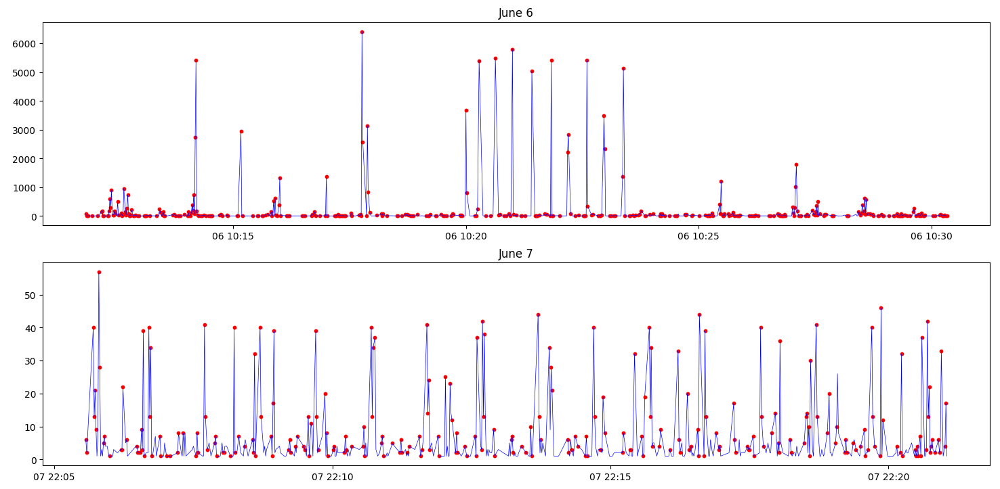

# Network Anomaly Detector 
A project to detect anomalies in a home network.

I made it because I wanted to combine machine learning with network security — two fields I'm interested in.

## Built with
- Python
- Scapy
- Pandas
- Scikit-learn (Isolation Forest)

## How it works
The program reads a pcap file made with wireshark through scapy. It then resamples the data with Pandas to find features that later can be used for training the model to find anomalies through Scikit-learn (Isolation Forest).

## Results so far

